# GWAS
Input files: BC_GS_ES_SLO

## Quantifying population stratification: IBS clustering
```javascript
../../plink_mac/plink --dog --file ../../data/BC_GS_ES_SLO --maf 0.05 --mind 0.05 --geno 0.05 --ci 0.95 --hwe 0.0001 --cluster --mds-plot 4 --cc --ppc 0.05 --out BC_GS_ES_SLOclust
```
*  file conversion to make TFAM file for MDS plot
```javascript
../plink_mac/plink --dog --file BC_GS_ES_SLO --recode transpose --out BC_GS_ES_SLO
```

MDS plots were generated in R using [this code](BC_GS_ES_SLO_mds.R).

* MDS by clusters (as determined by the PPC threshold)
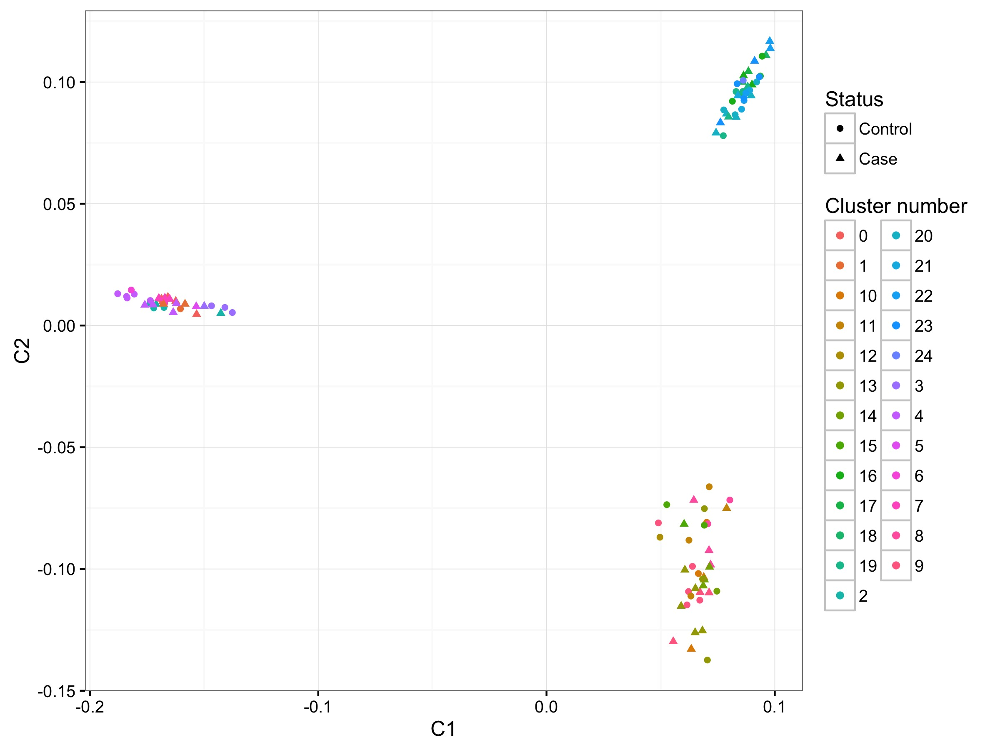

* MDS by breed
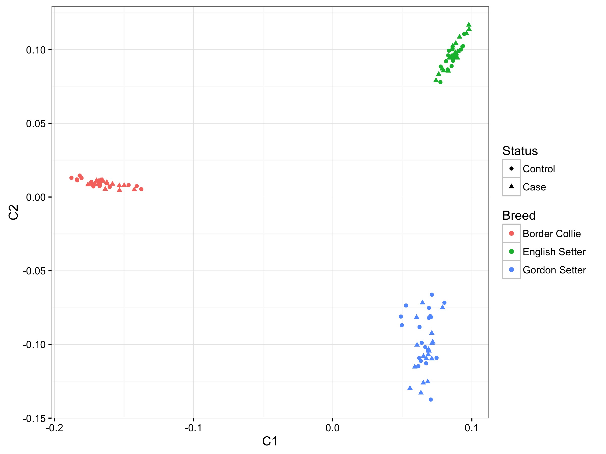

## GWA, without accounting for population stratification
1. Association with no permutations
```javascript
../../plink_mac/plink --assoc --dog --file ../../data/BC_GS_ES_SLO --maf 0.05 --mind 0.05 --geno 0.05 --ci 0.95 --hwe 0.0001 --adjust --out BC_GS_ES_SLO_as1
```
  * Genomic inflation: lambda = 1.00608
  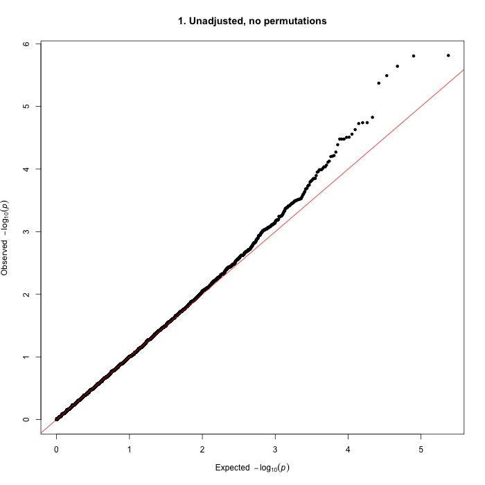
  * Unadjusted (for multiple testing) p-values
  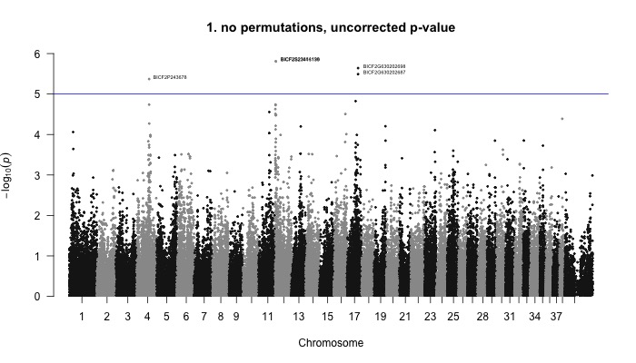
  
  NOTE: most Bonferroni-corrected p-values were = 1, so the Manhattan plot was not plotted
  
```
 CHR               SNP      UNADJ         GC       BONF       HOLM   SIDAK_SS   SIDAK_SD     FDR_BH     FDR_BY
  12    BICF2S23661198  1.538e-06  1.654e-06     0.1832     0.1832     0.1674     0.1674    0.09072          1 
  12    BICF2S23416139  1.567e-06  1.685e-06     0.1866     0.1866     0.1702     0.1702    0.09072          1 
  17   BICF2G630202698  2.285e-06  2.451e-06     0.2722     0.2721     0.2383     0.2383    0.09072          1 
  17   BICF2G630202687  3.229e-06  3.458e-06     0.3847     0.3847     0.3193     0.3193    0.09617          1 
   4      BICF2P243678  4.258e-06  4.551e-06     0.5072     0.5071     0.3978     0.3978     0.1014          1 
  17   BICF2G630207334  1.495e-05  1.586e-05          1          1     0.8315     0.8315     0.2474          1 
  12      BICF2P742333  1.817e-05  1.926e-05          1          1     0.8852     0.8851     0.2474          1 
   4      BICF2P182666  1.823e-05  1.932e-05          1          1     0.8859     0.8859     0.2474          1 
  12    BICF2S23021596  1.879e-05  1.991e-05          1          1     0.8933     0.8933     0.2474          1 
 ```

2. Association with permutations
```javascript
../../plink_mac/plink --assoc mperm=100000 --dog --file ../../data/BC_GS_ES_SLO --maf 0.05 --mind 0.05 --geno 0.05 --ci 0.95 --hwe 0.0001 --adjust --out BC_GS_ES_SLO_as2
```
* Genomic inflation: lambda = 1.00608

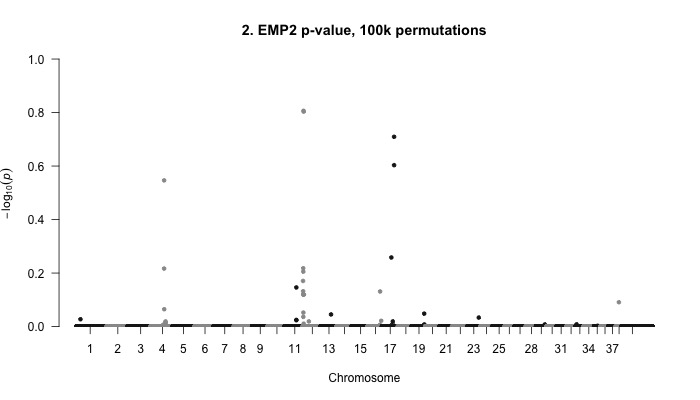
  
```
$ sort -k 4n BC_GS_ES_SLO_as2.assoc.mperm | head
 CHR               SNP         EMP1         EMP2
  12    BICF2S23661198        1e-05       0.1561 
  12    BICF2S23416139        1e-05       0.1572 
  17   BICF2G630202698        1e-05       0.1953 
  17   BICF2G630202687        1e-05       0.2493 
   4      BICF2P243678      1.5e-05       0.2842 
  17   BICF2G630207334        6e-05       0.5518 
  12      BICF2P742333     0.000145       0.6053 
   4      BICF2P182666      0.00014        0.607 
  12    BICF2S23021596        4e-05       0.6234 
```
Used GWAS SNPs CanFam3.1 location.xlsx to look up 3.1 position

| Rank | CHR | SNP | EMP1 | EMP2 | Position 3.1 | rs number | 
|:---:|---:|---|---|---|---:|---|
| 1 | 12 | BICF2S23661198 | 0.00001 | 0.1561 | 2473964 | [rs22185797](http://www.ensembl.org/Canis_familiaris/Variation/Explore?db=core;r=12:2473258-2474258;source=dbSNP;v=rs22185797;vdb=variation;vf=1314807) |
| 2 | 12 | BICF2S23416139 | 0.00001 | 0.1572 | 3101865 | [rs22186263](http://www.ensembl.org/Canis_familiaris/Variation/Explore?db=core;r=12:3101093-3102093;source=dbSNP;v=rs22186263;vdb=variation;vf=1315284) |
| 3 | 17 | BICF2G630202698 | 0.00001 | 0.1953 | 48369295 | [rs22596044](http://www.ensembl.org/Canis_familiaris/Variation/Explore?db=core;r=17:48369000-48370000;source=dbSNP;v=rs22596044;vdb=variation;vf=1664100) |
| 4 | 17 | BICF2G630202687 | 0.00001 | 0.2493 | 48374217 | [rs22596067](http://www.ensembl.org/Canis_familiaris/Variation/Explore?db=core;r=17:48373346-48374346;source=dbSNP;v=rs22596067;vdb=variation;vf=1664130) |
| 5 | 4 | BICF2P243678 | 0.000015 | 0.2842 | 54175193 | [rs24159394](http://www.ensembl.org/Canis_familiaris/Variation/Explore?db=core;r=4:54175139-54175339;source=dbSNP;v=rs24159394;vdb=variation;vf=2972206) |
| 6 | 17 | BICF2G630207334 | 0.00006 | 0.5518 | 37355221 | [rs22544206](http://www.ensembl.org/Canis_familiaris/Variation/Explore?db=core;r=17:37355000-37355500;source=dbSNP;v=rs22544206;vdb=variation;vf=1623209) |
| 7 | 12 | BICF2P742333 | 0.000145 | 0.6053 | 1333326 | [rs8925396](http://www.ensembl.org/Canis_familiaris/Variation/Explore?db=core;r=12:1333300-1333400;source=dbSNP;v=rs8925396;vdb=variation;vf=1079606) |
| 8 | 4 | BICF2P182666 | 0.00014 | 0.607 | 54176263 | [rs24159649](http://www.ensembl.org/Canis_familiaris/Variation/Explore?db=core;r=4:54176200-54176300;source=dbSNP;v=rs24159649;vdb=variation;vf=2972462) |
| 9 | 12 | BICF2S23021596 | 0.00004 | 0.6234 | 1640573 | [rs22257558](http://www.ensembl.org/Canis_familiaris/Variation/Explore?db=core;r=12:1640500-1640600;source=dbSNP;v=rs22257558;vdb=variation;vf=1381602) |

Rank 1. BICF2S23661198 
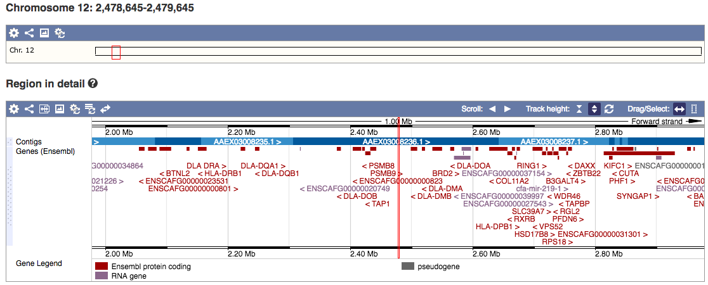

Rank 2. BICF2S23416139
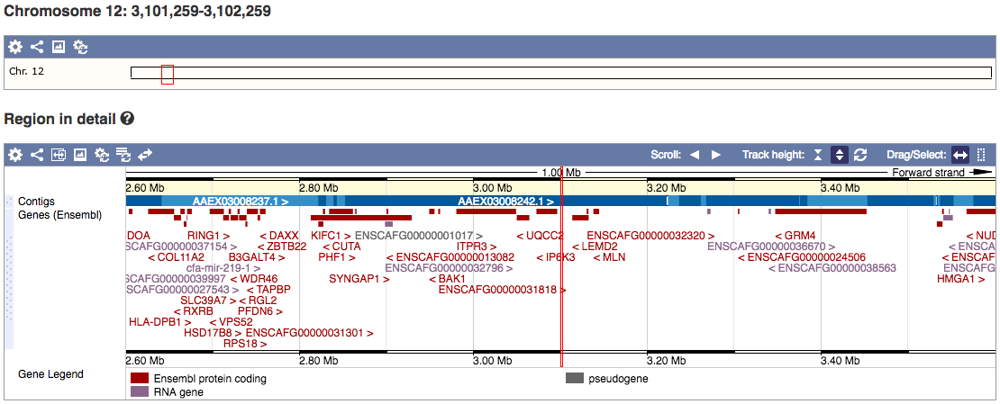

Rank 3. BICF2G630202698 and rank 4. BICF2G630202687
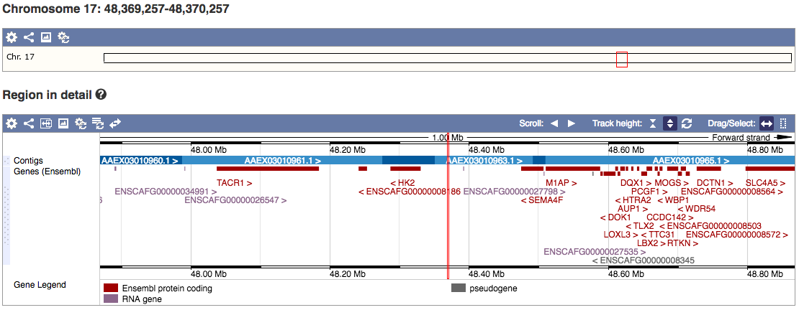

Rank 5. BICF2P243678 and rank 8. BICF2P182666
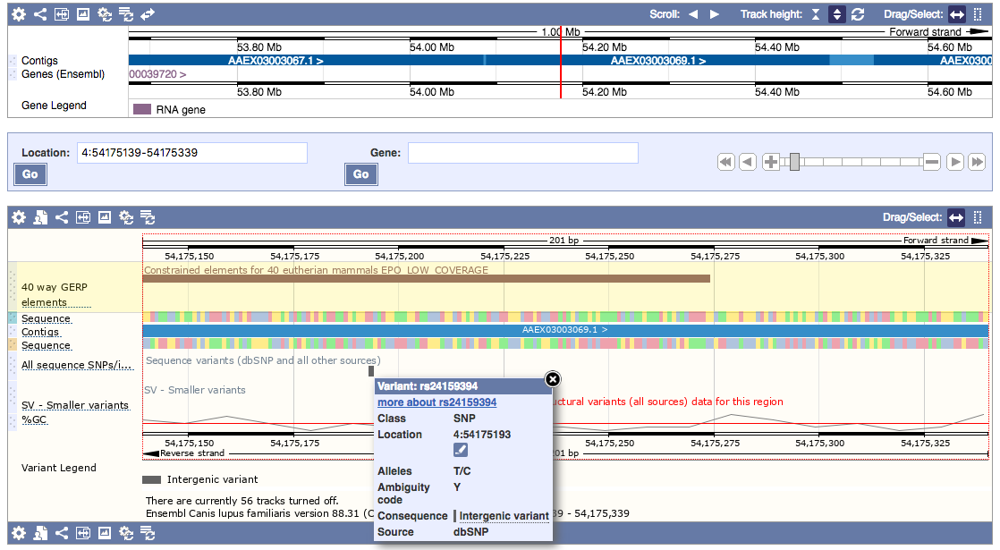

Rank 6. BICF2G630207334
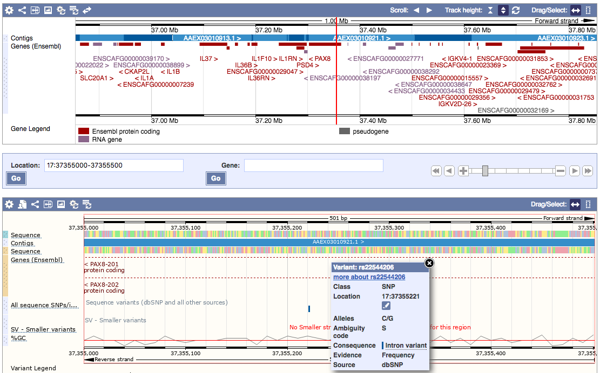

Rank 7. BICF2P742333
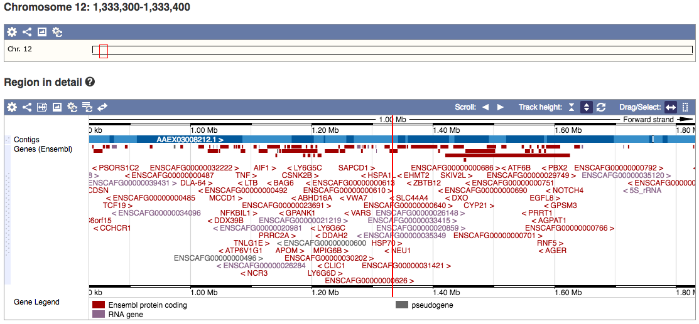

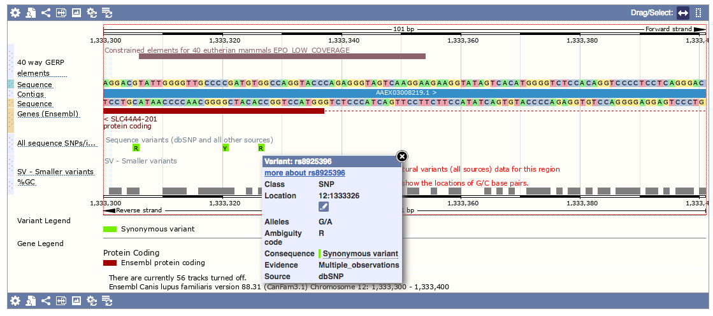

Rank 9. BICF2S23021596
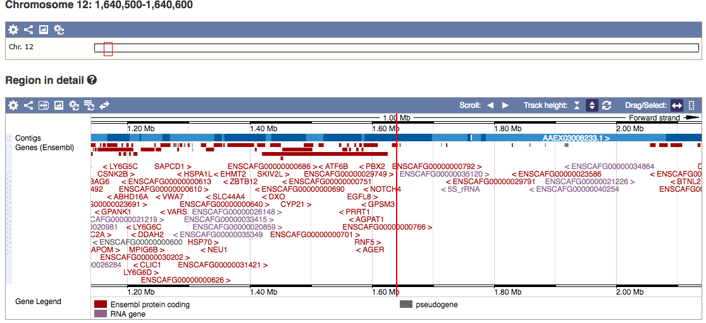


