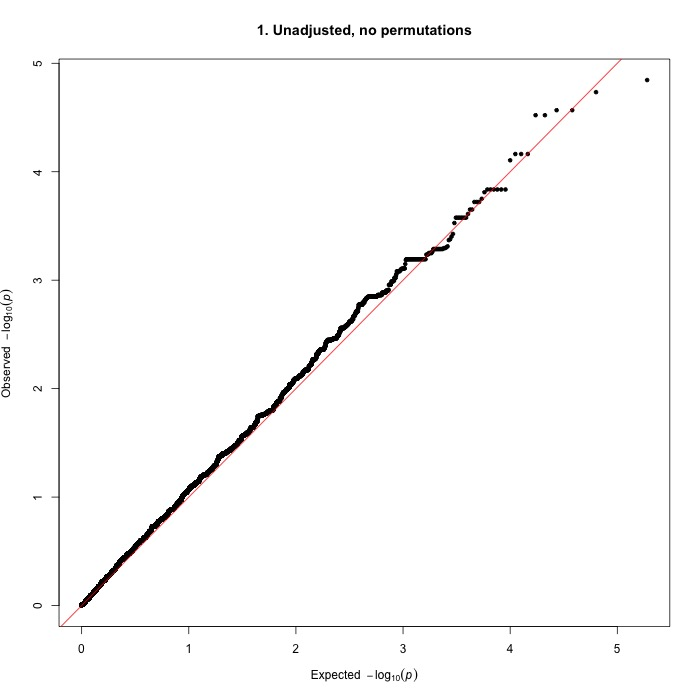
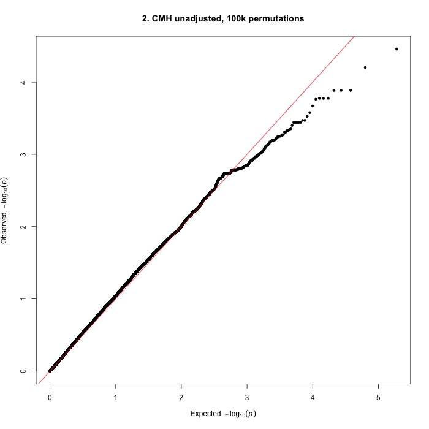
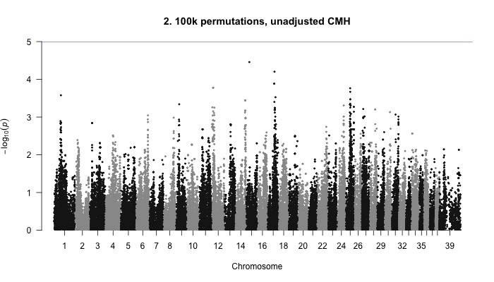
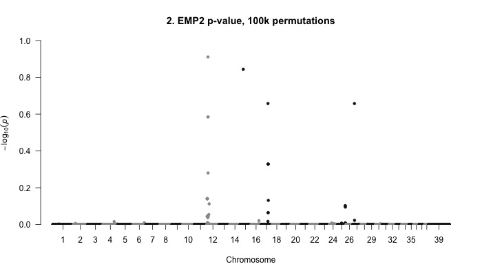
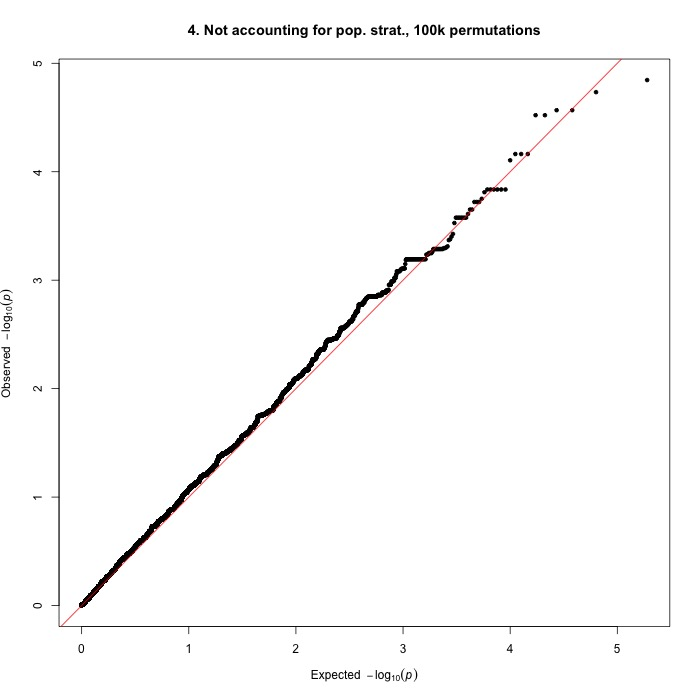
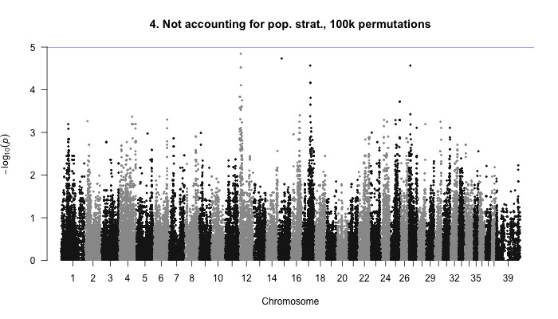
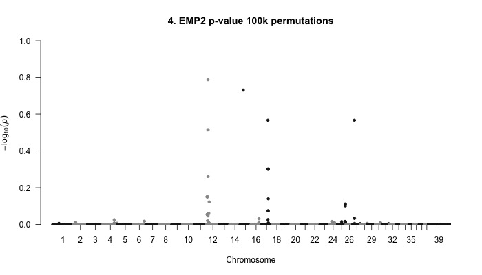

# GWAS of SLO in Bearded Collies

All code was run using [PLINK 1.9](https://www.cog-genomics.org/plink2) unless otherwise stated.

## Accounting for population stratification: IBS clustering

```javascript
../plink_mac/plink  --dog --tfile ../data/bc43 --maf 0.05 --mind 0.05 --geno 0.05 --ci 0.95 --hwe 0.0001 --cluster --mds-plot 4 --cc --ppc 0.05 --out ../analyses/bc43clust
```

* cc: case-control clustering so every cluster has at least one case and one control
* ppc: pairwise population concordance (PPC) test
* [hwe](https://www.cog-genomics.org/plink/1.9/filter): Hardy-Weinberg Equilibrium; filters out all variants which have Hardy-Weinberg equilibrium exact test p-value below the provided threshold

Results:
MDS plot (primatively plotted in R using [this code](mds.R))


## GWA, accounting for clustering
All QQ-plots and Manhattan plots were plotted in R using qqman ([github page](https://github.com/stephenturner/qqman), [tutorial](https://cran.r-project.org/web/packages/qqman/vignettes/qqman.html))
NOTE: To get the annotatePval and annotateTop functions (annotate the SNPs that meet a certain p-value threshold), need to download the latest version using

```
library(devtools)
install_github("stephenturner/qqman")
```

1. No permutations
```javascript
../plink_mac/plink --assoc --dog --tfile ../data/bc43 --maf 0.05 --mind 0.05 --geno 0.05 --ci 0.95 --hwe 0.0001 --adjust qq-plot --within bc43clust.cluster2 --mh --out bcslo_as1
```
  * --mh computes a weighted average of the per-stratum odds ratios for each variant, along with a 1df chi-square statistic and p-value (for the null hypothesis that odds ratios for all strata are equal to 1)
    * outputs to *.cmh
  * Unadjusted (for multiple testing) p-values
    * Lambda = 1.12441
   
  
  ```
 CHR                       SNP      UNADJ         GC         QQ       BONF       HOLM   SIDAK_SS   SIDAK_SD     FDR_BH     FDR_BY
  12              BICF2P181951  1.428e-05  4.269e-05  5.254e-06          1          1      0.743      0.743     0.4775          1 
  15            BICF2S23659643  1.846e-05   5.37e-05  1.576e-05          1          1     0.8273     0.8273     0.4775          1 
  27            BICF2S23345401  2.709e-05  7.568e-05  2.627e-05          1          1      0.924      0.924     0.4775          1 
  17   TIGRP2P231653_rs8622368  2.709e-05  7.568e-05  3.678e-05          1          1      0.924      0.924     0.4775          1 
  12             BICF2P1238963  3.011e-05  8.318e-05  4.729e-05          1          1      0.943      0.943     0.4775          1 
  12              BICF2P862529  3.011e-05  8.318e-05   5.78e-05          1          1      0.943      0.943     0.4775          1 
  17              BICF2P344354  6.866e-05  0.0001739  6.831e-05          1          1     0.9985     0.9985     0.6491          1 
  17              BICF2P188558  6.866e-05  0.0001739  7.881e-05          1          1     0.9985     0.9985     0.6491          1 
  17   TIGRP2P231762_rs8654637  6.866e-05  0.0001739  8.932e-05          1          1     0.9985     0.9985     0.6491          1 
  ```
  
  * CMH p-value (Stratified case/control analysis)
    * Lambda = 1.08756
  
  
  
  ```
 CHR                       SNP      UNADJ         GC         QQ       BONF       HOLM   SIDAK_SS   SIDAK_SD     FDR_BH     FDR_BY
  15            BICF2S23659643  3.488e-05  7.222e-05  5.254e-06          1          1     0.9638     0.9638     0.8145          1 
  17              BICF2P530823  6.266e-05   0.000124  1.576e-05          1          1     0.9974     0.9974     0.8145          1 
  17              BICF2P297728  0.0001302  0.0002436  2.627e-05          1          1          1          1     0.8145          1 
  17            BICF2S23153368  0.0001302  0.0002436  3.678e-05          1          1          1          1     0.8145          1 
  17             BICF2P1375437  0.0001302  0.0002436  4.729e-05          1          1          1          1     0.8145          1 
  12              BICF2P862529  0.0001678   0.000308   5.78e-05          1          1          1          1     0.8145          1 
  12             BICF2P1238963  0.0001678   0.000308  6.831e-05          1          1          1          1     0.8145          1 
  12              BICF2P181951  0.0001678   0.000308  7.882e-05          1          1          1          1     0.8145          1 
  25            BICF2G63094997  0.0001723  0.0003156  8.933e-05          1          1          1          1     0.8145          1 
  ```
  
2. With permutations
```javascript
../plink_mac/plink --assoc --dog --tfile ../data/bc43 --maf 0.05 --mind 0.05 --geno 0.05 --ci 0.95 --hwe 0.0001 --adjust qq-plot --within bc43clust.cluster2 --mh --mperm 100000 --out bcslo_as2
```
  * Unadjusted (for multiple testing) p-values
      * Lambda = 1.12441
  
  
  ```
 CHR                       SNP      UNADJ         GC         QQ       BONF       HOLM   SIDAK_SS   SIDAK_SD     FDR_BH     FDR_BY
  12              BICF2P181951  1.428e-05  4.269e-05  5.254e-06          1          1      0.743      0.743     0.4775          1 
  15            BICF2S23659643  1.846e-05   5.37e-05  1.576e-05          1          1     0.8273     0.8273     0.4775          1 
  27            BICF2S23345401  2.709e-05  7.568e-05  2.627e-05          1          1      0.924      0.924     0.4775          1 
  17   TIGRP2P231653_rs8622368  2.709e-05  7.568e-05  3.678e-05          1          1      0.924      0.924     0.4775          1 
  12             BICF2P1238963  3.011e-05  8.318e-05  4.729e-05          1          1      0.943      0.943     0.4775          1 
  12              BICF2P862529  3.011e-05  8.318e-05   5.78e-05          1          1      0.943      0.943     0.4775          1 
  17              BICF2P344354  6.866e-05  0.0001739  6.831e-05          1          1     0.9985     0.9985     0.6491          1 
  17              BICF2P188558  6.866e-05  0.0001739  7.881e-05          1          1     0.9985     0.9985     0.6491          1 
  17   TIGRP2P231762_rs8654637  6.866e-05  0.0001739  8.932e-05          1          1     0.9985     0.9985     0.6491          1 
  ```
  
  * Unadjusted CMH p-value (Stratified case/control analysis)
    * Lambda = 1.08756
  
  
  ```
 CHR                       SNP      UNADJ         GC         QQ       BONF       HOLM   SIDAK_SS   SIDAK_SD     FDR_BH     FDR_BY
  15            BICF2S23659643  3.488e-05  7.222e-05  5.254e-06          1          1     0.9638     0.9638     0.8145          1 
  17              BICF2P530823  6.266e-05   0.000124  1.576e-05          1          1     0.9974     0.9974     0.8145          1 
  17              BICF2P297728  0.0001302  0.0002436  2.627e-05          1          1          1          1     0.8145          1 
  17            BICF2S23153368  0.0001302  0.0002436  3.678e-05          1          1          1          1     0.8145          1 
  17             BICF2P1375437  0.0001302  0.0002436  4.729e-05          1          1          1          1     0.8145          1 
  12              BICF2P862529  0.0001678   0.000308   5.78e-05          1          1          1          1     0.8145          1 
  12             BICF2P1238963  0.0001678   0.000308  6.831e-05          1          1          1          1     0.8145          1 
  12              BICF2P181951  0.0001678   0.000308  7.882e-05          1          1          1          1     0.8145          1 
  25            BICF2G63094997  0.0001723  0.0003156  8.933e-05          1          1          1          1     0.8145          1 
  ```
  * EMP2 p-value
  
  
  
  ```
  $ sort -k 4n bcslo_as2.assoc.mperm | head
 CHR                       SNP         EMP1         EMP2 
  12              BICF2P181951     0.002185       0.1227 
  15            BICF2S23659643      0.00131       0.1432 
  17   TIGRP2P231653_rs8622368      0.00063       0.2199 
  27            BICF2S23345401     0.000575       0.2199 
  12              BICF2P862529     0.002185       0.2601 
  12             BICF2P1238963     0.002185       0.2601 
  17              BICF2P188558     0.000225       0.4694 
  17              BICF2P344354     0.000225       0.4694 
  17   TIGRP2P231762_rs8654637     0.000225       0.4694 
  ```
  
## GWA without accounting for population stratification
3. No permutations
```javascript
../plink_mac/plink --assoc --dog --tfile ../data/bc43 --maf 0.05 --mind 0.05 --geno 0.05 --ci 0.95 --hwe 0.0001 --adjust qq-plot --out bcslo_as3
```
  * Unadjusted (for multiple testing) p-values
      * Lambda = 1.12441
      
      

4. With permutations
```javascript
../plink_mac/plink --assoc mperm=100000 --dog --tfile ../data/bc43 --maf 0.05 --mind 0.05 --geno 0.05 --ci 0.95 --hwe 0.0001 --adjust --out bcslo_as4
```
  * Unadjusted (for multiple testing) p-values
      * Lambda = 1.12441
  
  
  * EMP2 p-value
  
  

```
$ sort -k 4n bcslo_as4.assoc.mperm | head
 CHR                       SNP         EMP1         EMP2 
  12              BICF2P181951      0.00034       0.1633 
  15            BICF2S23659643     0.000705       0.1858 t
  17   TIGRP2P231653_rs8622368        5e-05       0.2709 
  27            BICF2S23345401      4.5e-05       0.2709 
  12              BICF2P862529      0.00049       0.3056 
  12             BICF2P1238963      0.00049       0.3056 
  17              BICF2P188558       0.0001       0.5002 
  17              BICF2P344354       0.0001       0.5002 
  17   TIGRP2P231762_rs8654637       0.0001       0.5002
```
