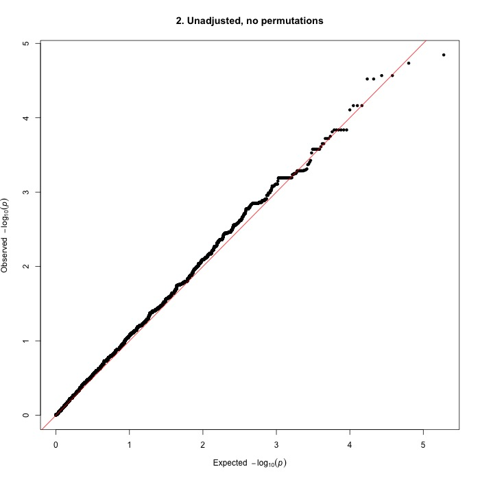

# GWAS of SLO in Bearded Collies

All code was run using [PLINK 1.9](https://www.cog-genomics.org/plink2) unless otherwise stated.

## Accounting for population stratification: IBS clustering

```javascript
../plink_mac/plink  --dog --tfile ../data/bc43 --maf 0.05 --mind 0.05 --geno 0.05 --ci 0.95 --hwe 0.0001 --cluster --mds-plot 4 --cc --ppc 0.05 --out ../analyses/bc43clust
```

* cc: case-control clustering so every cluster has at least one case and one control
* ppc: pairwise population concordance (PPC) test
* [hwe](https://www.cog-genomics.org/plink/1.9/filter): Hardy-Weinberg Equilibrium; filters out all variants which have Hardy-Weinberg equilibrium exact test p-value below the provided threshold

Results:
MDS plot (primatively plotted in R using [this code](mds.R))


## GWA, accounting for clustering
All QQ-plots and Manhattan plots were plotted in R using qqman ([github page](https://github.com/stephenturner/qqman), [tutorial](https://cran.r-project.org/web/packages/qqman/vignettes/qqman.html))
NOTE: To get the annotatePval and annotateTop functions (annotate the SNPs that meet a certain p-value threshold), need to download the latest version using

```
library(devtools)
install_github("stephenturner/qqman")
```

1. No permutations
```javascript
../plink_mac/plink --assoc --dog --tfile ../data/bc43 --maf 0.05 --mind 0.05 --geno 0.05 --ci 0.95 --hwe 0.0001 --adjust qq-plot --within bc43clust.cluster2 --mh --out bcslo_as1
```
  * --mh computes a weighted average of the per-stratum odds ratios for each variant, along with a 1df chi-square statistic and p-value (for the null hypothesis that odds ratios for all strata are equal to 1)
    * outputs to *.cmh
  * Unadjusted (for multiple testing) p-values
    * Lambda = 1.12441
   
  
  * CMH p-value (Stratified case/control analysis)
    * Lambda = 1.08756
  
  
  
2. With permutations
```javascript
../plink_mac/plink --assoc --dog --tfile ../data/bc43 --maf 0.05 --mind 0.05 --geno 0.05 --ci 0.95 --hwe 0.0001 --adjust qq-plot --within bc43clust.cluster2 --mh --mperm 100000 --out bcslo_as2
```
  * Unadjusted (for multiple testing) p-values
      * Lambda = 1.12441
  
  
  * Unadjusted CMH p-value (Stratified case/control analysis)
    * Lambda = 1.08756
  
  
  * EMP2 p-value
  
  
  
## GWA without accounting for population stratification
3. No permutations
```javascript
../plink_mac/plink --assoc --dog --tfile ../data/bc43 --maf 0.05 --mind 0.05 --geno 0.05 --ci 0.95 --hwe 0.0001 --adjust qq-plot --out bcslo_as3
```
  * Unadjusted (for multiple testing) p-values
      * Lambda = 1.12441
      
      

4. With permutations
```javascript
../plink_mac/plink --assoc mperm=100000 --dog --tfile ../data/bc43 --maf 0.05 --mind 0.05 --geno 0.05 --ci 0.95 --hwe 0.0001 --adjust --out bcslo_as4
```
  * Unadjusted (for multiple testing) p-values
      * Lambda = 1.12441
  
  
  * EMP2 p-value
  
  


## Runs of homozygosity
1. Determine average LD block size and how man SNPs are in each block
```javascript
../plink_mac/plink --dog --chr 1-38 --ci .95 --mind .95 --geno .05 --blocks no-pheno-req no-small-max-span --blocks-max-kb 1000 --homozyg-window-het 0 --homozyg-window-missing 100 --tfile ../data/bc43 --out roh1
```
2. ROH that differ between cases and controls
```javascript
--allow-no-sex --chr 1-38 --ci 0.95 --dog --geno 0.05 --homozyg group --homozyg-kb 1000 --homozyg-match 0.95 --homozyg-snp 200 --homozyg-window-het 0 --homozyg-window-missing 100 --mind 0.05 --out roh2 --pool-size 3 --tfile ../data/bc43
```

  * `--homozyg-window-het 0` means not allowing any individual to be heterozyous (no misscalls)
  * `--pool-size 3` means minimum number of dogs in each pool used to create haplotype 
  * `--homozyg-snp 200` how many adjacent SNPs that must be homozygous to be considered a block
      * value depends on SNP chip density, LD block size
      


