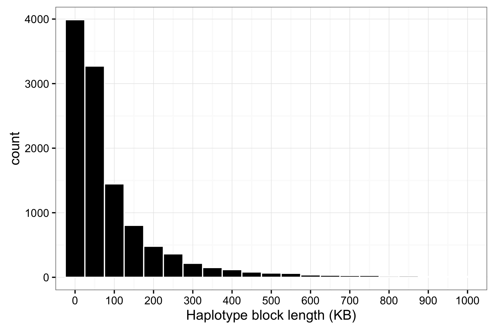

## Runs of homozygosity

### Background
Excerpt from [McQuillan et al. 2008](http://www.sciencedirect.com/science/article/pii/S000292970800445X)


### I. Determine average LD block size and how many SNPs are in each block
1. [Haplotype block estimation](https://www.cog-genomics.org/plink/1.9/ld#blocks)
```javascript
../plink_mac/plink --dog --chr 1-38 --ci .95 --mind .95 --geno .05 --blocks no-pheno-req no-small-max-span --blocks-max-kb 1000 --homozyg-window-het 0 --homozyg-window-missing 100 --tfile ../data/bc43 --out roh1
```
* Output:
```
 $ sort -rk 5 roh1.blocks.det | head
 CHR          BP1          BP2           KB  NSNPS SNPS
  17      5904397      6903346       998.95     79 BICF2S23915494|BICF2P951492|BICF2P343752|BICF2P1063360|BICF2P877975|BICF2P173724|BICF2P493085|BICF2P182306|BICF2P355704|BICF2P1130225|BICF2P600156|BICF2P720896|BICF2P890946|BICF2P299038|BICF2P1137067|BICF2S23152942|BICF2P1112437|BICF2P893724|BICF2P534964|BICF2P433514|BICF2P378564|BICF2P1318720|BICF2P620340|BICF2P480015|BICF2S2309799|BICF2P1387596|BICF2P143896|BICF2P434518|BICF2P1229082|BICF2P137482|BICF2P132066|BICF2P675025|BICF2S23635451|BICF2P607003|BICF2P1082905|BICF2S2296100|BICF2S23432228|BICF2P1303965|BICF2P118111|BICF2P1163277|BICF2S23532091|BICF2P786710|BICF2P752911|BICF2P811020|BICF2P849774|BICF2P557665|BICF2P405352|BICF2S23512699|BICF2S23230791|BICF2P810309|BICF2P561877|BICF2P1385072|BICF2P737478|BICF2P331184|BICF2P579751|BICF2P730559|BICF2P1409195|BICF2P836251|BICF2P440140|BICF2P1275710|BICF2P167120|BICF2P1425469|BICF2P1325149|BICF2P489034|BICF2P504182|BICF2S23746746|BICF2P276785|BICF2P1320169|BICF2P866771|BICF2S23425627|BICF2P1109613|BICF2S23311364|BICF2P325423|BICF2P1271191|BICF2P628745|BICF2S23131330|BICF2P686324|BICF2P303104|BICF2P1444349
  13      3059745      4054152      994.408     74 BICF2G630602144|BICF2G630602161|BICF2G630602166|BICF2P905576|BICF2G630602185|BICF2G630602202|BICF2G630602211|BICF2G630602213|BICF2G630602219|BICF2G630602228|BICF2G630602240|BICF2S23118753|BICF2G630602264|BICF2G630602279|BICF2G630602317|BICF2P788594|BICF2G630602323|BICF2G630602327|BICF2G630602334|BICF2G630602340|BICF2G630602345|BICF2G630602347|BICF2G630602358|BICF2G630602361|BICF2G630602382|BICF2G630602385|BICF2G630602390|BICF2P435750|BICF2G630602398|BICF2G630602408|BICF2G630602412|BICF2G630602420|BICF2G630602425|BICF2P125003|BICF2G630602435|BICF2G630602441|BICF2G630602449|BICF2G630602450|BICF2G630602458|BICF2G630602462|BICF2G630602471|BICF2G630602491|BICF2G630602511|BICF2G630602515|BICF2G630602523|BICF2G630602525|BICF2G630602532|BICF2G630602547|BICF2G630602554|BICF2G630602563|BICF2G630602566|BICF2P1493587|BICF2G630602580|BICF2G630602584|BICF2G630602592|BICF2P622589|BICF2G630602605|BICF2G630602606|BICF2P150235|BICF2G630602616|BICF2G630602622|BICF2G630602624|BICF2P1044527|BICF2G630602636|BICF2G630602641|BICF2G630602646|BICF2G630602649|BICF2G630602652|BICF2G630602653|BICF2G630602673|BICF2G630602679|BICF2G630602681|BICF2G630602693|BICF2G630602706
  22      5256787      6256473      999.687     69 BICF2P23426|BICF2G630314804|BICF2G630314813|BICF2G630314821|BICF2G630314831|BICF2G630314841|BICF2G630314845|BICF2S234180|BICF2G630314865|BICF2G630314877|BICF2G630314884|BICF2G630314891|BICF2G630314896|BICF2G630314905|BICF2G630314908|BICF2G630314909|BICF2G630314912|BICF2G630314914|BICF2P48823|BICF2G630314925|BICF2G630314932|BICF2G630314936|BICF2G630314941|BICF2G630314945|BICF2G630314947|BICF2G630314960|BICF2G630314963|BICF2G630314965|BICF2S23419213|BICF2G630314972|BICF2G630314978|BICF2G630314979|BICF2G630314984|BICF2G630314995|BICF2G630315006|BICF2G630315023|BICF2G630315034|BICF2G630315044|BICF2G630315083|BICF2G630315094|BICF2G630315119|BICF2G630315123|BICF2G630315134|BICF2G630315143|BICF2G630315158|BICF2G630315160|BICF2P854212|BICF2G630315202|BICF2G630315211|BICF2G630315244|BICF2G630315295|BICF2G630315305|BICF2P1074615|BICF2G630315318|BICF2G630315326|BICF2G630315350|BICF2G630315359|BICF2G630315361|BICF2G630315388|BICF2G630315390|BICF2G630315414|BICF2P606806|BICF2G630315440|BICF2G630315446|BICF2G630315451|BICF2G630315457|BICF2P963469|BICF2G630315488|BICF2G630315495
  34      4015917      5009609      993.693     69 BICF2P154380|BICF2P1271542|BICF2P1276538|BICF2P1276532|BICF2P999949|BICF2P754849|BICF2P940082|BICF2P1401428|BICF2P1441305|BICF2P977414|TIGRP2P392397_rs9056793|BICF2P344895|BICF2P200603|BICF2P1374806|BICF2S2337712|BICF2P306139|BICF2P1326602|BICF2P1073515|BICF2P443205|TIGRP2P392466_rs8931049|BICF2S2317261|BICF2S23514058|BICF2P407941|BICF2S2399226|BICF2P290252|BICF2P7444|TIGRP2P392495_rs8737341|BICF2S23422695|BICF2S24310840|BICF2P170320|BICF2P1145157|BICF2P520642|BICF2S23446485|BICF2P1048704|TIGRP2P392539_rs8708883|BICF2S23114563|BICF2S2348905|BICF2P216998|BICF2P600962|BICF2S2351722|BICF2P1410975|BICF2P433418|BICF2P775923|BICF2P971507|BICF2P278485|BICF2P26529|TIGRP2P392652_rs9232592|BICF2P545520|BICF2P745239|BICF2P255832|BICF2P1012350|BICF2P736056|TIGRP2P392677_rs9122910|BICF2S23112737|BICF2P599692|BICF2P1005594|BICF2P513528|TIGRP2P392702_rs8908311|TIGRP2P392704_rs8630116|BICF2P584331|TIGRP2P392709_rs9062762|BICF2P448655|BICF2P139557|BICF2P781575|BICF2P95956|BICF2P1464671|BICF2P1455838|BICF2P1197255|TIGRP2P392755_rs9069810
  19      7011376      7992709      981.334     68 BICF2P705244|BICF2P809764|BICF2S23340710|BICF2P253519|BICF2P999378|BICF2P1498445|BICF2P359819|BICF2P734772|BICF2P487038|BICF2P959507|BICF2P761095|BICF2P358605|BICF2P1280580|BICF2P867668|BICF2P587207|BICF2P181849|BICF2S23024273|BICF2P1088856|BICF2P1103981|BICF2P664090|BICF2P1319474|BICF2S23030794|BICF2S23427032|BICF2P67604|BICF2P546921|BICF2P711610|BICF2P526094|BICF2P1232371|BICF2S23327718|BICF2P868834|BICF2P679270|BICF2P1410607|BICF2P1037958|BICF2P503109|BICF2P371443|BICF2P962853|BICF2P345084|BICF2P1164966|BICF2P1044404|BICF2P1058900|BICF2P196484|BICF2S23017210|BICF2P783316|BICF2P1353222|BICF2P329561|BICF2P475817|BICF2P886684|BICF2P911811|BICF2P1192350|BICF2P165258|BICF2P930248|BICF2P86428|BICF2P924889|BICF2P519503|BICF2P741458|BICF2P351425|BICF2P868312|BICF2P582186|BICF2P471977|BICF2P508367|BICF2P595238|BICF2P1393003|BICF2P1133686|BICF2P765276|BICF2P19804|BICF2P601192|BICF2P1203937|BICF2P211037
  19      9448030     10432657      984.628     62 BICF2P1050690|BICF2P290270|BICF2P1137235|BICF2P948567|BICF2P1308332|BICF2S23533853|BICF2P937135|BICF2P1087470|BICF2P65113|BICF2P1098083|BICF2P1194946|BICF2P971769|BICF2S23628912|BICF2P903534|BICF2P501167|BICF2P487610|BICF2S23513042|BICF2P50184|BICF2S23731496|BICF2P1312286|BICF2P1323328|BICF2P314183|BICF2P37887|BICF2S23750984|BICF2P1457169|BICF2P436745|BICF2P420460|BICF2P847980|BICF2S23741617|BICF2P1055303|BICF2P557770|BICF2P717596|BICF2P587055|BICF2P564008|BICF2P1299421|BICF2S23141983|BICF2S23338833|BICF2S2335748|BICF2P91980|BICF2P77126|BICF2P935113|BICF2P1334457|BICF2P1151958|BICF2P1043438|BICF2P1311205|BICF2P444487|BICF2P1222027|BICF2S23325630|BICF2P722175|BICF2P722189|BICF2P1420604|BICF2P20015|BICF2P118475|BICF2S23433453|BICF2P774674|BICF2P986229|BICF2P588787|BICF2P198259|BICF2P78275|BICF2P1172646|BICF2P967314|BICF2P553236
  13     24167569     25165808       998.24     59 BICF2P1355985|BICF2S23658277|BICF2S2347915|BICF2P1259600|BICF2P974023|BICF2G630614003|BICF2G630614021|BICF2G630614032|BICF2P702513|BICF2G630614053|BICF2G630614063|BICF2P1115931|BICF2G630614072|BICF2G630614108|BICF2G630614121|BICF2G630614146|BICF2G630614211|BICF2G630614225|BICF2G630614227|BICF2G630614231|BICF2G630614261|BICF2P183094|BICF2S23345340|BICF2G630614296|BICF2G630614306|BICF2S23710419|BICF2G630614312|BICF2P700830|BICF2G630614334|BICF2P1231598|BICF2P997148|BICF2P631048|BICF2P1404531|BICF2P698619|BICF2P230727|BICF2S23620436|BICF2P345231|BICF2S23243733|BICF2G630614443|BICF2G630614476|BICF2G630614496|BICF2G630614505|BICF2G630614534|BICF2G630614547|BICF2G630614558|BICF2G630614565|BICF2G630614585|BICF2G630614605|BICF2G630614606|BICF2G630614620|BICF2G630614627|BICF2G630614670|BICF2G630614691|BICF2G630614728|BICF2G630614744|BICF2G630614746|BICF2G630614764|BICF2G630614770|BICF2S23714554
   5      4445761      5445283      999.523     58 BICF2S23618216|BICF2P886802|BICF2S23527029|BICF2S23140940|BICF2S2379205|BICF2P742243|BICF2S23347253|BICF2S23056544|G322f34S191|BICF2S23418659|BICF2S2345424|BICF2S23714765|BICF2S23061033|BICF2S23617519|BICF2S23233354|BICF2S23427325|BICF2S23752195|BICF2S23736883|BICF2P1298577|BICF2P954875|BICF2S23121225|BICF2P1219699|BICF2P287339|BICF2P1140415|BICF2S23323013|BICF2P1114742|BICF2P1238072|BICF2P96458|BICF2P96460|BICF2P818281|BICF2P818283|BICF2P1056586|BICF2P302891|BICF2P1019023|BICF2P1209432|BICF2P262272|BICF2P708831|BICF2P520838|BICF2P782395|BICF2P567634|BICF2P908011|BICF2P1457733|BICF2S23245588|BICF2P735121|BICF2P527923|BICF2P978257|BICF2P443580|BICF2P1183273|BICF2P913682|BICF2P1171838|BICF2S23311911|BICF2P270770|BICF2P29644|BICF2P274313|BICF2P40584|BICF2P950563|BICF2P1146050|BICF2P663601
   1      3639224      4637254      998.031     57 BICF2G630707984|BICF2G630707991|BICF2G630708013|BICF2G630708020|BICF2G630708023|BICF2G630708027|BICF2G630708028|BICF2G630708032|BICF2P188815|BICF2P410099|BICF2P238696|BICF2P1124921|BICF2G630708039|BICF2P466666|BICF2P646761|BICF2P1404670|BICF2P615194|BICF2P1178503|BICF2G630708049|BICF2P970528|BICF2P303607|BICF2P972673|BICF2P195485|BICF2P987431|BICF2P742102|BICF2P1104224|BICF2P1277518|BICF2P1277519|BICF2G630708061|BICF2P1065496|BICF2P1032299|BICF2G630708083|BICF2P112561|BICF2P760763|BICF2G630708109|BICF2G630708111|BICF2G630708113|BICF2G630708125|BICF2G630708127|BICF2G630708142|BICF2G630708148|BICF2G630708152|BICF2G630708156|BICF2G630708163|BICF2G630708166|BICF2P1442152|BICF2G630708170|BICF2G630708173|BICF2G630708176|BICF2G630708179|BICF2G630708182|BICF2G630708185|BICF2G630708186|BICF2P1154406|BICF2P247436|BICF2P562192|BICF2G630708194
```
* With `--blocks-max-kb 1000`, the length (bp) of many haplotype blocks are still at the maximum threshold --> increase the max-kb to capture longer blocks

2. [Haplotype block estimation](https://www.cog-genomics.org/plink/1.9/ld#blocks)
```javascript
../plink_mac/plink --dog --chr 1-38 --ci .95 --mind .95 --geno .05 --blocks no-pheno-req no-small-max-span --blocks-max-kb 10000 --homozyg-window-het 0 --homozyg-window-missing 100 --tfile ../data/bc43 --out roh2
```

Output:
```
 CHR          BP1          BP2           KB  NSNPS SNPS
  13      3036181      9478177         6442    233 BICF2G630602134|BICF2G630602144|BICF2G630602161|BICF2G630602166|BICF2P905576|BICF2G630602185|BICF2G630602202|BICF2G630602211|BICF2G630602213|BICF2G630602219|BICF2G630602228|BICF2G630602240|BICF2S23118753|BICF2G630602264|BICF2G630602279|BICF2G630602317|BICF2P788594|BICF2G630602323|BICF2G630602327|BICF2G630602334|BICF2G630602340|BICF2G630602345|BICF2G630602347|BICF2G630602358|BICF2G630602361|BICF2G630602382|BICF2G630602385|BICF2G630602390|BICF2P435750|BICF2G630602398|BICF2G630602408|BICF2G630602412|BICF2G630602420|BICF2G630602425|BICF2P125003|BICF2G630602435|BICF2G630602441|BICF2G630602449|BICF2G630602450|BICF2G630602458|BICF2G630602462|BICF2G630602471|BICF2G630602491|BICF2G630602511|BICF2G630602515|BICF2G630602523|BICF2G630602525|BICF2G630602532|BICF2G630602547|BICF2G630602554|BICF2G630602563|BICF2G630602566|BICF2P1493587|BICF2G630602580|BICF2G630602584|BICF2G630602592|BICF2P622589|BICF2G630602605|BICF2G630602606|BICF2P150235|BICF2G630602616|BICF2G630602622|BICF2G630602624|BICF2P1044527|BICF2G630602636|BICF2G630602641|BICF2G630602646|BICF2G630602649|BICF2G630602652|BICF2G630602653|BICF2G630602673|BICF2G630602679|BICF2G630602681|BICF2G630602693|BICF2G630602706|BICF2G630602713|BICF2G630602747|BICF2G630602752|BICF2G630602762|BICF2G630602771|BICF2G630602784|BICF2G630602798|BICF2G630602815|BICF2P933613|BICF2G630602836|BICF2G630602837|BICF2P922869|BICF2G630602845|BICF2G630602851|BICF2G630602856|BICF2P444644|BICF2G630602865|BICF2G630602874|BICF2G630602876|BICF2P957335|BICF2G630602893|BICF2G630602899|BICF2G630602905|BICF2P841532|BICF2G630602913|BICF2P1326570|BICF2G630602922|BICF2G630602925|BICF2G630602926|BICF2G630602931|BICF2G630602935|BICF2S23411122|BICF2S23733704|BICF2G630602944|BICF2G630602946|BICF2G630602950|BICF2G630602962|BICF2G630602965|BICF2G630602969|BICF2G630602973|BICF2G630602978|BICF2G630602992|BICF2G630603007|BICF2G630603022|BICF2G630603030|BICF2G630603039|BICF2G630603044|BICF2G630603047|BICF2G630603051|BICF2G630603058|BICF2G630603065|BICF2G630603074|BICF2G630603095|BICF2G630603118|BICF2G630603122|BICF2P542422|BICF2G630603152|BICF2G630603160|BICF2P983357|BICF2G630603235|BICF2G630603346|BICF2G630603359|BICF2G630603469|BICF2G630603470|BICF2P41815|BICF2P212177|BICF2P809484|BICF2P324609|BICF2P1445804|TIGRP2P181042_rs8752974|BICF2P643476|BICF2P643473|TIGRP2P181056_rs9040793|TIGRP2P181067_rs8730125|TIGRP2P181073_rs9064035|TIGRP2P181083_rs8813898|TIGRP2P181111_rs8703803|BICF2P103050|BICF2P652420|TIGRP2P181139_rs8982906|BICF2P867078|BICF2P1224076|BICF2P319605|BICF2P539973|BICF2P775727|BICF2S2378899|TIGRP2P181167_rs8671465|BICF2P665153|TIGRP2P181170_rs8670334|BICF2P782371|BICF2P245526|BICF2P889350|BICF2P1263141|BICF2S23144512|BICF2P990678|BICF2G630603527|BICF2P536955|BICF2G630603538|BICF2P651696|BICF2G630603545|BICF2P535075|BICF2P955005|BICF2P298945|TIGRP2P181257_rs8955981|TIGRP2P181265_rs8685944|TIGRP2P181270_rs9134711|BICF2S23020894|TIGRP2P181290_rs9239018|TIGRP2P181293_rs9239013|BICF2P384765|TIGRP2P181379_rs9030370|BICF2G630603587|BICF2P494104|BICF2G630603616|BICF2G630603637|BICF2P890617|BICF2G630603677|BICF2S2456735|BICF2P1414212|BICF2P347710|BICF2G630603779|BICF2G630603792|BICF2P33744|BICF2G630603806|BICF2G630603817|BICF2G630603823|BICF2G630603827|BICF2S23143168|BICF2S23355180|BICF2G630603839|BICF2G630603845|BICF2S23640649|BICF2G630603862|BICF2G630603865|BICF2G630603885|BICF2G630603890|BICF2G630603902|BICF2G630603915|BICF2G630603929|BICF2G630603951|BICF2G630603952|BICF2G630603961|BICF2G630603964|BICF2G630603967|BICF2S23913925|BICF2G630603982|BICF2G630603988|BICF2G630603989|BICF2P480953|BICF2G630604010|BICF2G630604056|BICF2G630604061|BICF2G630604069|BICF2G630604073|BICF2G630604075|BICF2G630604089|BICF2G630604094|BICF2G630604098
  19     31825955     36804617      4978.66    193 BICF2P438801|BICF2P590305|BICF2P864352|BICF2P966547|BICF2P876919|BICF2P452363|BICF2G63049902|TIGRP2P264808_rs8581027|BICF2P1022503|BICF2G63049957|TIGRP2P264843_rs9226083|TIGRP2P264856_rs9092443|BICF2P393904|BICF2S23139628|BICF2P1387526|BICF2P1306071|BICF2G63050123|BICF2P201948|BICF2G63050156|BICF2G63050168|BICF2G63050170|BICF2P1249060|TIGRP2P264909_rs8897311|BICF2P471982|BICF2G63050192|BICF2G63050193|BICF2G63050198|BICF2P1019450|BICF2P1203352|BICF2P122087|BICF2G63050213|BICF2S23022877|BICF2G63050232|TIGRP2P265000_rs9054441|BICF2G63050250|BICF2G63050275|BICF2P1270138|BICF2P1178535|BICF2S23024059|BICF2P1223872|BICF2S23060718|BICF2S23617032|BICF2S23551338|BICF2G63050446|BICF2P507614|BICF2P913784|BICF2S23739931|BICF2S2453214|BICF2S23647648|BICF2S23531756|BICF2G63050528|BICF2P580371|BICF2S2351737|BICF2G63050541|BICF2S23744264|BICF2G63050556|BICF2G63050569|BICF2G63050576|BICF2G63050588|BICF2P97803|BICF2G63050632|BICF2P1365770|TIGRP2P265218_rs9133439|BICF2G63050684|BICF2G63050711|BICF2G63050748|BICF2P848531|BICF2G63050818|BICF2S23157758|BICF2G63050851|BICF2G63050881|BICF2G63050890|BICF2P1412790|BICF2S23033310|TIGRP2P265303_rs9003390|BICF2G63050997|BICF2G63051035|BICF2G63051109|BICF2P1068463|TIGRP2P265371_rs8858358|BICF2G63051367|BICF2G63051448|BICF2G63051471|BICF2G63051476|BICF2G63051496|BICF2G63051560|BICF2G63051686|BICF2G63051731|BICF2P1270504|TIGRP2P265422_rs8823191|BICF2G63051790|BICF2G63051818|BICF2P897651|BICF2G63051969|BICF2G63051987|BICF2G63051988|BICF2G63052043|BICF2G63052053|BICF2G63052065|BICF2G63052135|BICF2G63052152|BICF2P763325|BICF2G63052205|BICF2P1198067|BICF2G63052214|BICF2G63052232|BICF2G63052239|BICF2G63052257|BICF2G63052262|BICF2G63052267|BICF2S23523435|TIGRP2P265546_rs8530041|BICF2G63052296|BICF2S2306826|BICF2P1448329|BICF2G63052309|BICF2G63052316|BICF2G63052327|BICF2P1014904|BICF2G63052342|BICF2G63052349|BICF2G63052351|BICF2G63052355|BICF2G63052357|BICF2G63052360|BICF2G63052368|BICF2G63052371|BICF2G63052390|BICF2P1455114|BICF2G63052448|BICF2G63052485|BICF2P619915|BICF2S23742123|BICF2G63052527|BICF2G63052535|BICF2G63052548|BICF2G63052563|BICF2G63052587|BICF2G63052750|BICF2S23244985|BICF2G63052827|BICF2G63052873|BICF2G63052877|BICF2G63052884|BICF2G63052944|BICF2S2369674|BICF2G63052969|BICF2G63053087|BICF2P387117|BICF2G63053106|BICF2G63053160|BICF2P1260155|BICF2S23043417|BICF2P885483|BICF2P1246922|TIGRP2P265717_rs8815098|TIGRP2P265719_rs8907560|BICF2P328594|BICF2P588591|BICF2S23728318|BICF2P260301|BICF2S23426263|BICF2P939568|BICF2P75707|TIGRP2P265778_rs8770339|BICF2P576489|BICF2P1434142|BICF2P816109|BICF2S23036334|BICF2S23042186|BICF2P493625|BICF2P1295580|BICF2S23033734|BICF2P349383|BICF2P117037|BICF2P659928|BICF2P660182|TIGRP2P265887_rs8928907|BICF2S23713682|TIGRP2P265979_rs8922755|BICF2P459116|TIGRP2P266033_rs9149965|TIGRP2P266040_rs8557521|BICF2P844618|BICF2P104657|BICF2P601225|BICF2P500488|BICF2P536623|BICF2P1131956|BICF2P1428796|BICF2P824986|BICF2S23137281|BICF2S22924527
  24      5555441     11150548      5595.11    174 BICF2P81665|BICF2P847623|BICF2P967937|BICF2P462467|BICF2P1269466|BICF2P1198275|BICF2S24512141|G1246f53S282|BICF2S23034294|BICF2S23144326|BICF2P1058742|TIGRP2P323068_rs8540697|BICF2P974226|BICF2S23148067|BICF2S23148272|BICF2S2334789|TIGRP2P323077_rs8580044|BICF2P526385|BICF2P1201567|BICF2S23736814|TIGRP2P323102_rs8492937|BICF2P807127|BICF2S2301021|BICF2P829138|BICF2P814009|BICF2P337238|BICF2P236774|BICF2P885126|BICF2P442035|BICF2P1289437|BICF2P1014718|BICF2P158995|BICF2P750925|BICF2P569320|BICF2S23449120|BICF2P671807|BICF2P1114906|BICF2P585356|BICF2P746761|BICF2P1128146|BICF2S23632922|BICF2P952450|BICF2P1005361|BICF2P981210|BICF2P669473|BICF2P1505687|BICF2P984149|BICF2P1358337|BICF2P753162|BICF2P1209086|BICF2P366050|BICF2P1470978|BICF2P309387|BICF2P602842|BICF2P859266|BICF2P976388|BICF2P1050248|BICF2P689943|BICF2P181394|BICF2P1359824|BICF2P1134144|BICF2P799320|BICF2S23430618|BICF2P455385|BICF2P210146|BICF2P274577|BICF2P145511|BICF2P1041785|BICF2P1355900|BICF2P1231466|BICF2P889059|BICF2P1392692|BICF2P674007|BICF2P722594|BICF2P1008051|BICF2P1328366|BICF2P172297|BICF2P872500|BICF2P213046|BICF2S23419909|TIGRP2P323158_rs9249625|BICF2P977787|BICF2P380782|BICF2S23242306|BICF2P287530|TIGRP2P323195_rs8776379|BICF2P1389978|TIGRP2P323204_rs9041575|BICF2P298904|BICF2P1369526|TIGRP2P323228_rs8796986|BICF2P513677|TIGRP2P323247_rs8917176|TIGRP2P323268_rs8916209|BICF2P415579|TIGRP2P323318_rs8579227|BICF2P797272|TIGRP2P323337_rs8557807|BICF2P1378405|BICF2S23214127|BICF2P1468833|BICF2S22952983|BICF2S2298094|TIGRP2P323396_rs8820352|BICF2G630513906|BICF2G630513840|BICF2G630513829|BICF2G630513810|BICF2G630513798|BICF2G630513791|BICF2G630513783|BICF2P301146|BICF2G630513702|BICF2G630513648|BICF2P976847|BICF2G630513609|BICF2G630513596|BICF2G630513579|BICF2S23130304|BICF2G630513567|BICF2G630513564|TIGRP2P323457_rs8973888|BICF2G630513341|BICF2G630513340|BICF2G630513300|BICF2S2357174|BICF2P1426911|BICF2P1363251|BICF2P57501|BICF2P574827|BICF2G630513268|BICF2G630513255|BICF2P1347778|BICF2S2359452|BICF2S23256521|BICF2P852261|BICF2P676545|BICF2G630513223|TIGRP2P323519_rs8518247|BICF2G630513212|BICF2G630513181|BICF2G630513180|BICF2G630513169|BICF2G630513147|BICF2G630513116|BICF2P372704|BICF2P383215|BICF2G630513078|BICF2G630513068|BICF2G630513064|BICF2G630513042|BICF2G630513028|BICF2G630513018|BICF2G630513016|BICF2G630512979|BICF2G630512977|BICF2G630512954|BICF2P538795|BICF2G630512943|BICF2P879486|TIGRP2P310626_rs9170255|BICF2G630512782|BICF2G630512776|BICF2P1032230|BICF2G630512673|BICF2P407254|BICF2G630512636|BICF2G630512346|BICF2G630512335|BICF2G630512326|BICF2G630512322|BICF2G630512318|BICF2G630512309|BICF2G630512247
   5      4219765      6484160       2264.4    132 BICF2S2362618|BICF2S23325646|BICF2S2397964|BICF2S23313764|BICF2P862384|BICF2S23251062|BICF2S23618216|BICF2P886802|BICF2S23527029|BICF2S23140940|BICF2S2379205|BICF2P742243|BICF2S23347253|BICF2S23056544|G322f34S191|BICF2S23418659|BICF2S2345424|BICF2S23714765|BICF2S23061033|BICF2S23617519|BICF2S23233354|BICF2S23427325|BICF2S23752195|BICF2S23736883|BICF2P1298577|BICF2P954875|BICF2S23121225|BICF2P1219699|BICF2P287339|BICF2P1140415|BICF2S23323013|BICF2P1114742|BICF2P1238072|BICF2P96458|BICF2P96460|BICF2P818281|BICF2P818283|BICF2P1056586|BICF2P302891|BICF2P1019023|BICF2P1209432|BICF2P262272|BICF2P708831|BICF2P520838|BICF2P782395|BICF2P567634|BICF2P908011|BICF2P1457733|BICF2S23245588|BICF2P735121|BICF2P527923|BICF2P978257|BICF2P443580|BICF2P1183273|BICF2P913682|BICF2P1171838|BICF2S23311911|BICF2P270770|BICF2P29644|BICF2P274313|BICF2P40584|BICF2P950563|BICF2P1146050|BICF2P663601|BICF2P962049|BICF2P876078|BICF2P283157|BICF2P593671|BICF2P966369|BICF2P658310|BICF2P1405369|BICF2P164675|BICF2S23346904|BICF2P1273243|BICF2P936669|BICF2P409122|BICF2P338231|BICF2P1359807|BICF2P410802|BICF2S23729849|BICF2P1076530|BICF2P763240|BICF2P802518|BICF2P760534|BICF2S23217065|BICF2P813213|BICF2P462619|BICF2P349906|BICF2P547074|BICF2P137781|BICF2S23764501|BICF2S2331712|BICF2S23041361|BICF2P275085|BICF2S23061625|BICF2P669852|BICF2P565692|BICF2P422273|BICF2P1224352|BICF2P1049948|BICF2P27137|BICF2S23130444|BICF2P1267468|BICF2S23311427|BICF2P94903|BICF2S22918910|BICF2P822990|BICF2S23317601|BICF2S23225204|BICF2P1463618|BICF2S2368993|BICF2S22919400|BICF2S22951159|BICF2P946923|BICF2S23424650|BICF2S22956006|BICF2S23718810|BICF2S23423433|BICF2S23044458|BICF2P249643|BICF2P998148|BICF2S23443345|BICF2P623280|BICF2S2339277|BICF2P1201958|BICF2S23621667|BICF2S2367248|BICF2S22948594|BICF2P346474|BICF2P821272|BICF2P496900|BICF2S23342198
  22      4814897      6810548      1995.65    131 BICF2P422205|BICF2G630314307|BICF2G630314311|BICF2G630314314|BICF2P337375|BICF2P661495|BICF2G630314368|BICF2G630314381|BICF2G630314402|BICF2G630314408|BICF2G630314409|BICF2P423480|BICF2G630314429|BICF2G630314444|BICF2G630314461|BICF2S2449499|BICF2G630314476|BICF2G630314480|BICF2G630314487|BICF2P675860|BICF2G630314532|BICF2G630314555|BICF2G630314591|BICF2G630314614|BICF2G630314627|BICF2G630314655|BICF2G630314664|BICF2G630314693|BICF2G630314702|BICF2G630314710|BICF2G630314720|BICF2G630314740|BICF2G630314750|BICF2G630314755|BICF2P23426|BICF2G630314804|BICF2G630314813|BICF2G630314821|BICF2G630314831|BICF2G630314841|BICF2G630314845|BICF2S234180|BICF2G630314865|BICF2G630314877|BICF2G630314884|BICF2G630314891|BICF2G630314896|BICF2G630314905|BICF2G630314908|BICF2G630314909|BICF2G630314912|BICF2G630314914|BICF2P48823|BICF2G630314925|BICF2G630314932|BICF2G630314936|BICF2G630314941|BICF2G630314945|BICF2G630314947|BICF2G630314960|BICF2G630314963|BICF2G630314965|BICF2S23419213|BICF2G630314972|BICF2G630314978|BICF2G630314979|BICF2G630314984|BICF2G630314995|BICF2G630315006|BICF2G630315023|BICF2G630315034|BICF2G630315044|BICF2G630315083|BICF2G630315094|BICF2G630315119|BICF2G630315123|BICF2G630315134|BICF2G630315143|BICF2G630315158|BICF2G630315160|BICF2P854212|BICF2G630315202|BICF2G630315211|BICF2G630315244|BICF2G630315295|BICF2G630315305|BICF2P1074615|BICF2G630315318|BICF2G630315326|BICF2G630315350|BICF2G630315359|BICF2G630315361|BICF2G630315388|BICF2G630315390|BICF2G630315414|BICF2P606806|BICF2G630315440|BICF2G630315446|BICF2G630315451|BICF2G630315457|BICF2P963469|BICF2G630315488|BICF2G630315495|BICF2G630315504|BICF2G630315513|BICF2G630315522|BICF2G630315527|BICF2S2309389|BICF2G630315536|BICF2G630315539|BICF2G630315557|BICF2G630315573|BICF2G630315581|BICF2G630315598|BICF2P986603|BICF2G630315631|BICF2G630315646|BICF2G630315662|BICF2G630315679|BICF2G630315690|BICF2G630315703|BICF2G630315722|BICF2G630315746|BICF2S23533022|BICF2P1501133|BICF2P1322846|BICF2P1206236|BICF2P934135|BICF2P1114669|BICF2P332385|BICF2P805175
  17      3716900      6589462      2872.56    124 BICF2P87482|BICF2S22917859|BICF2P580911|BICF2P132405|BICF2P300786|BICF2P639693|BICF2S23653084|BICF2S23133896|BICF2P385376|BICF2P306386|BICF2P1110927|BICF2P1051987|BICF2P630251|BICF2P620199|BICF2P1068660|BICF2P1364289|BICF2S23661069|BICF2P1208784|BICF2P1119969|BICF2P201829|BICF2P998863|BICF2P458683|BICF2P1071767|BICF2P1384877|BICF2P918168|BICF2S234537|BICF2S23661342|BICF2S23429932|BICF2S23512567|BICF2S2363377|BICF2S23711182|BICF2P677273|BICF2S22921923|BICF2P1077976|BICF2P1003612|BICF2P161592|BICF2P381243|BICF2P1206942|BICF2S23753281|BICF2S23539509|BICF2P626558|BICF2P52776|BICF2P720164|BICF2P720162|BICF2P1329823|BICF2P1010594|BICF2P845313|BICF2P656328|BICF2P149939|BICF2P958961|BICF2P710163|BICF2S23633304|BICF2S23142779|BICF2S2317584|BICF2P1375614|BICF2P1315329|BICF2P100187|BICF2P1371929|BICF2P425003|BICF2S23633042|BICF2S23433672|BICF2S23650258|BICF2P617915|BICF2S23425567|BICF2S23643251|BICF2P213000|BICF2S23510605|BICF2P235443|BICF2S23531842|BICF2S23519389|BICF2S23915494|BICF2P951492|BICF2P343752|BICF2P1063360|BICF2P877975|BICF2P173724|BICF2P493085|BICF2P182306|BICF2P355704|BICF2P1130225|BICF2P600156|BICF2P720896|BICF2P890946|BICF2P299038|BICF2P1137067|BICF2S23152942|BICF2P1112437|BICF2P893724|BICF2P534964|BICF2P433514|BICF2P378564|BICF2P1318720|BICF2P620340|BICF2P480015|BICF2S2309799|BICF2P1387596|BICF2P143896|BICF2P434518|BICF2P1229082|BICF2P137482|BICF2P132066|BICF2P675025|BICF2S23635451|BICF2P607003|BICF2P1082905|BICF2S2296100|BICF2S23432228|BICF2P1303965|BICF2P118111|BICF2P1163277|BICF2S23532091|BICF2P786710|BICF2P752911|BICF2P811020|BICF2P849774|BICF2P557665|BICF2P405352|BICF2S23512699|BICF2S23230791|BICF2P810309|BICF2P561877|BICF2P1385072|BICF2P737478|BICF2P331184
  25     29298903     32203266      2904.36    109 BICF2G63095187|BICF2S2295809|BICF2G63095196|BICF2S23040620|BICF2S22915744|BICF2S23060299|BICF2G63095281|BICF2G63095301|BICF2G63095323|BICF2G63095335|BICF2G63095342|BICF2P1025839|BICF2G63095391|BICF2G63095407|BICF2P105881|BICF2G63095467|BICF2G63095472|BICF2G63095567|BICF2G63095608|BICF2P1168126|BICF2S23534846|BICF2G63095769|BICF2G63095785|BICF2G63095787|BICF2G63095791|BICF2G63095822|BICF2P463633|BICF2G63095842|BICF2G63095879|BICF2G63095891|BICF2G63095904|BICF2G63095908|BICF2G63095915|BICF2G63095922|BICF2G63095943|BICF2G63095975|BICF2S23750643|BICF2G63096049|BICF2G63096050|BICF2G63096052|TIGRP2P327889_rs8602307|BICF2S23658503|BICF2G63096199|BICF2G63096229|BICF2G63096239|BICF2G63096275|BICF2G63096341|BICF2G63096371|BICF2G63096372|BICF2G63096414|BICF2P563446|BICF2G63096456|BICF2S23143617|BICF2G63096461|BICF2G63096505|BICF2P615642|BICF2G63096506|BICF2G63096543|BICF2G63096552|BICF2P551150|BICF2G63096620|BICF2P316025|BICF2G63096711|BICF2P721866|BICF2G63096837|BICF2G63096859|BICF2G63096890|BICF2G63096893|BICF2G63096898|BICF2G63096902|BICF2P1091351|BICF2G63096918|BICF2G63096934|BICF2G63096943|BICF2P740589|BICF2G63096948|BICF2G63096953|BICF2G63096960|BICF2G63096986|BICF2G63097000|BICF2G63097030|BICF2G63097044|BICF2G63097056|BICF2G63097085|BICF2G63097090|BICF2G63097107|BICF2G63097114|BICF2G63097121|BICF2G63097129|BICF2P605423|BICF2P798820|BICF2P1715|BICF2G63097161|BICF2G63097169|BICF2G63097205|BICF2G63097219|BICF2G63097228|BICF2G63097282|TIGRP2P328140_rs9027241|BICF2P1234348|BICF2P650204|BICF2G63097320|BICF2G63097325|BICF2G63097350|BICF2G63097393|BICF2S23014867|TIGRP2P328171_rs8825774|BICF2G63097456|BICF2G63097520
   2      3409177      7176407      3767.23    103 BICF2S23128762|BICF2G630787414|BICF2P159389|BICF2G630787412|BICF2S2337495|BICF2P1199117|BICF2P295435|BICF2P330738|BICF2P93732|BICF2S22954321|BICF2G630787382|BICF2G630787377|BICF2G630787375|BICF2G630787370|BICF2G630787367|BICF2G630787362|BICF2G630787360|BICF2G630787350|BICF2G630787349|BICF2G630787348|BICF2G630787321|BICF2G630787311|BICF2G630787307|BICF2G630787301|BICF2G630787283|BICF2G630787280|BICF2G630787271|BICF2P78432|BICF2G630787263|BICF2G630787257|BICF2G630787254|BICF2G630787248|BICF2P1274714|BICF2G630787224|BICF2G630787220|BICF2G630787211|BICF2G630787204|BICF2G630787201|BICF2G630787198|BICF2G630787186|BICF2G630787180|BICF2G630787137|BICF2G630787114|BICF2G630787110|BICF2P577384|BICF2P1302479|BICF2G630787103|BICF2G630787101|BICF2P1230102|BICF2P365716|BICF2G630787094|BICF2G630787091|BICF2P1394965|BICF2P236454|BICF2G630787019|BICF2P1367877|BICF2G630786949|BICF2G630786943|BICF2G630786932|BICF2G630786923|BICF2G630786920|BICF2G630786894|BICF2G630786869|BICF2G630786866|BICF2G630786865|BICF2G630786863|BICF2G630786859|BICF2P1137726|BICF2G630786843|BICF2G630786840|BICF2S23447954|TIGRP2P23628_rs9053823|BICF2P1186286|BICF2P150433|BICF2P412639|BICF2P412638|BICF2P1049080|BICF2P548509|BICF2G630786821|BICF2G630786819|BICF2S23712037|BICF2S2339654|BICF2S22960655|BICF2S2373652|BICF2G630786788|BICF2S23515296|BICF2G630786782|BICF2S23760937|BICF2S23335456|BICF2G630786778|BICF2G630786776|BICF2G630786769|BICF2G630786767|BICF2G630786766|TIGRP2P23662_rs9082587|TIGRP2P23669_rs9240587|BICF2G630786609|BICF2G630786607|BICF2G630786520|G121f9S72|G123f13S146|G124f5S166|BICF2G630786465
  31      3277264      5360103      2082.84    102 BICF2G630726405|BICF2P477138|BICF2G630726418|BICF2P195634|BICF2S231356|BICF2G630726492|TIGRP2P375007_rs8531864|TIGRP2P375009_rs8588687|BICF2P771128|TIGRP2P375017_rs8631616|TIGRP2P375018_rs8936539|BICF2G630726513|BICF2P874732|BICF2S241964|BICF2P1027747|BICF2P251653|TIGRP2P375037_rs8764615|TIGRP2P375038_rs8889187|BICF2P608414|TIGRP2P375040_rs8701546|TIGRP2P375042_rs8759895|TIGRP2P375049_rs9188475|BICF2P1316049|BICF2P342869|TIGRP2P375056_rs8745998|BICF2P359589|TIGRP2P375063_rs9201495|BICF2G630726529|BICF2G630726542|BICF2G630726546|BICF2G630726553|BICF2P156621|BICF2G630726564|BICF2P979046|TIGRP2P375089_rs8879269|BICF2S23241650|BICF2G630726591|TIGRP2P375098_rs8681466|BICF2G630726597|BICF2G630726607|BICF2G630726657|TIGRP2P375123_rs8658324|BICF2G630726695|BICF2P972476|BICF2G630726698|TIGRP2P375162_rs9119370|BICF2G630726722|BICF2G630726728|BICF2P368574|BICF2P394472|BICF2P50843|BICF2P272953|BICF2P374762|TIGRP2P375211_rs9170602|BICF2G630726818|BICF2G630726827|BICF2G630726832|BICF2G630726861|BICF2G630726862|BICF2G630726871|BICF2P1074651|BICF2G630726889|BICF2G630726917|BICF2G630726919|BICF2G630726951|BICF2G630726998|BICF2G630727016|BICF2G630727037|BICF2G630727059|BICF2S22911314|BICF2G630727075|BICF2G630727080|BICF2G630727089|BICF2S22932660|BICF2P765621|TIGRP2P375260_rs8903703|BICF2G630727095|TIGRP2P375283_rs8776149|BICF2S22915950|BICF2S2377756|BICF2P1310019|BICF2P1171379|TIGRP2P377480_rs9118499|BICF2P29149|BICF2P708921|BICF2P503173|TIGRP2P377489_rs9086046|BICF2P352005|BICF2P1027221|BICF2P891982|BICF2P98316|BICF2G630727125|BICF2G630727135|BICF2S23328856|BICF2G630727158|BICF2S23742219|BICF2G630727166|BICF2P1413672|BICF2G630727173|BICF2G630727177|BICF2G630727187|BICF2G630727247
  ```
  * Longest haplotype block is 6.4 Mb and contains 233 SNPs, but super long haplotype blocks are rare.
  * Distribution of haplotype block sizes
  
  
  * Zoomed in
  
  
  
  * Distribution of the number of SNPs in each haplotype block
  
    * most common is 5-10 SNPs
  

### II. ROH that differ between cases and controls

1. Using default parameters for haplotype definition (contains 100 SNPs and >= 1000 kb)
```javascript
../plink_mac/plink --chr 1-38 --ci 0.95 --dog --geno 0.05 --homozyg group --homozyg-match 0.95 --mind 0.05 --pool-size 3 --tfile ../data/bc43 --out rohcc1
```
  * `--homozyg-group` --> `plink.hom.overlap` 

2. 
  * increase stringency of heterozygous calls `--homozyg-window-het 0`
  * decreasing number of missing calls allowed `--homozyg-window-missing 100`
  * decreasing haplotype block size allowed `--homozyg-kb 100`
```javascript
../plink_mac/plink --allow-no-sex --chr 1-38 --ci 0.95 --dog --geno 0.05 --homozyg group --homozyg-kb 100 --homozyg-match 0.95 --homozyg-snp 200 --homozyg-window-het 0 --homozyg-window-missing 100 --mind 0.05 --out rohcc2 --pool-size 3 --tfile ../data/bc43
```

  * `--homozyg-window-het 0` means not allowing any individual to be heterozyous (no misscalls)
  * `--pool-size 3` means minimum number of dogs in each pool used to create haplotype 
  * `--homozyg-snp 200` how many adjacent SNPs that must be homozygous to be considered a block
      * value depends on SNP chip density, LD block size

As is, this analysis should be performed on sets of SNPs that have been pruned for strong local LD (if the goal is to find long segments that are more likely to represent homozygosity by descent (i.e. autozygosity) rather than simply by chance). [PLINK](http://zzz.bwh.harvard.edu/plink/ibdibs.shtml#homo) 
