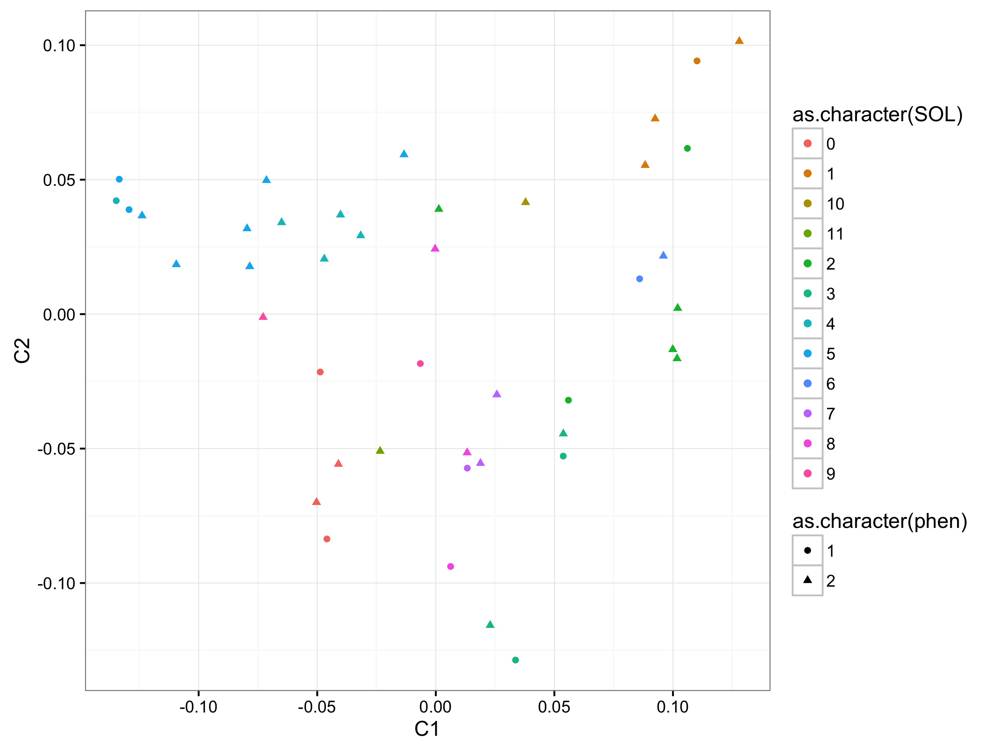

# GWAS of SLO in Bearded Collies

All code was run using [PLINK 1.9](https://www.cog-genomics.org/plink2) unless otherwise stated.

## Accounting for population stratification: IBS clustering

```javascript
./plink  --dog --tfile ../data/bc43 --maf 0.05 --mind 0.05 --geno 0.05 --ci 0.95 --hwe 0.0001 --cluster --mds-plot 4 --cc --ppc 0.05 --out ../analyses/bc43clust
```

* cc: case-control clustering so every cluster has at least one case and one control
* ppc: pairwise population concordance (PPC) test
* [hwe](https://www.cog-genomics.org/plink/1.9/filter): Hardy-Weinberg Equilibrium; filters out all variants which have Hardy-Weinberg equilibrium exact test p-value below the provided threshold

Results:
MDS plot (primatively plotted in R using [this code](mds.R))


## GWA
1. No permutations
```javascript
./plink --assoc --dog --tfile ../data/bc43 --maf 0.05 --mind 0.05 --geno 0.05 --ci 0.95 --hwe 0.0001 --adjust qq-plot --within ../analyses/bc43clust.cluster2 --make-bed --out ../analyses/bcslo_as1
```
  * Lambda = 1 (probably overestimated)

2. With permutations
```javascript
./plink --assoc --dog --tfile ../data/bc43 --maf 0.05 --mind 0.05 --geno 0.05 --ci 0.95 --hwe 0.0001 --adjust qq-plot --within ../analyses/bc43clust.cluster2 --make-bed --mperm 100000 --out ../analyses/bcslo_as2
```
  * Lambda = 1 (probably overestimated)
