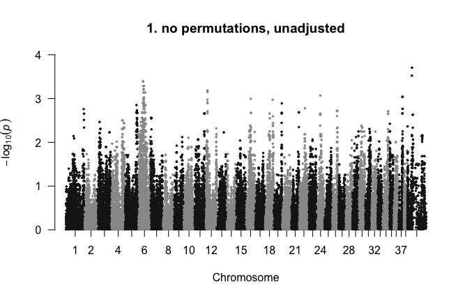
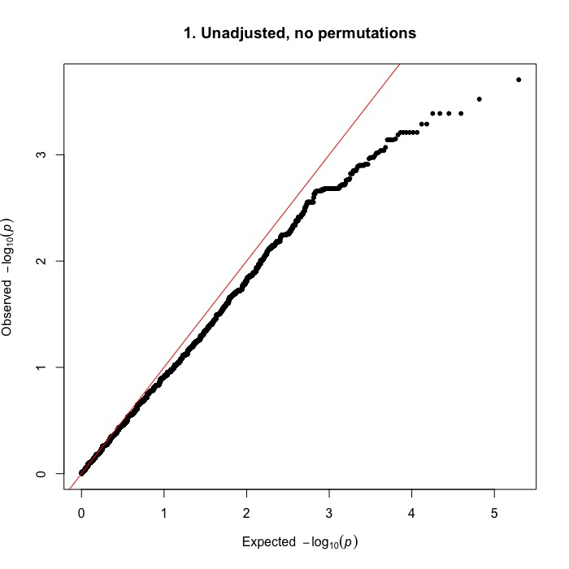
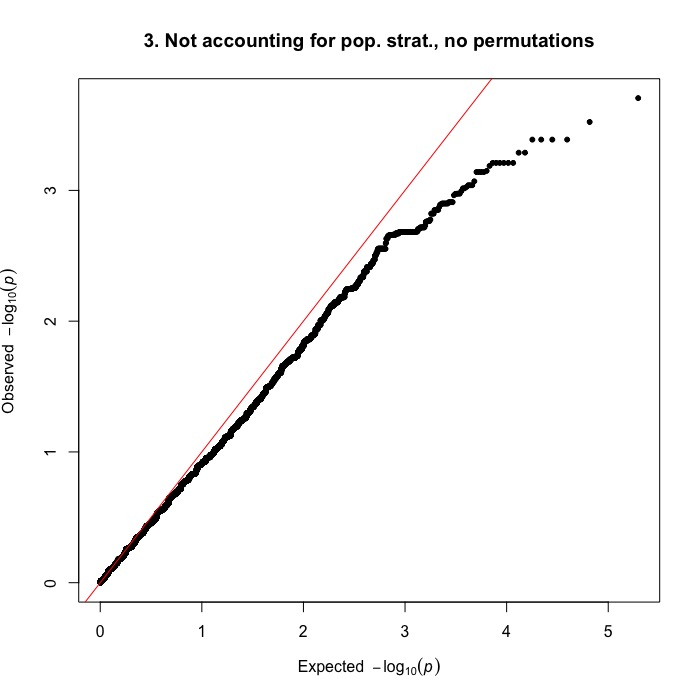
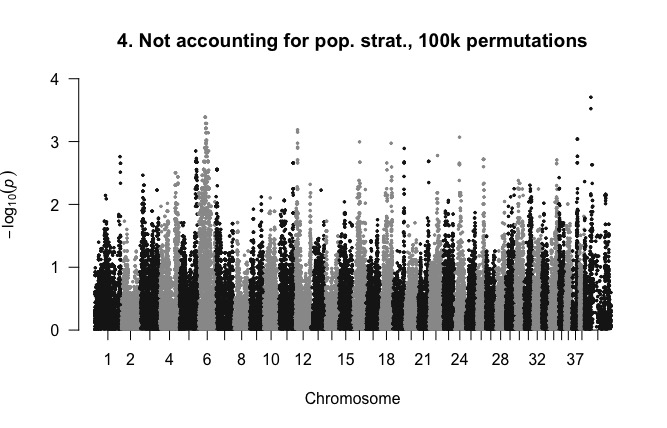

# GWAS of SLO in Bearded Collies

All code was run using [PLINK 1.9](https://www.cog-genomics.org/plink2) unless otherwise stated.

## Accounting for population stratification: IBS clustering

```javascript
./plink  --dog --tfile ../data/bc43 --maf 0.05 --mind 0.05 --geno 0.05 --ci 0.95 --hwe 0.0001 --cluster --mds-plot 4 --cc --ppc 0.05 --out ../analyses/bc43clust
```

* cc: case-control clustering so every cluster has at least one case and one control
* ppc: pairwise population concordance (PPC) test
* [hwe](https://www.cog-genomics.org/plink/1.9/filter): Hardy-Weinberg Equilibrium; filters out all variants which have Hardy-Weinberg equilibrium exact test p-value below the provided threshold

Results:
MDS plot (primatively plotted in R using [this code](mds.R))


## GWA, accounting for clustering
1. No permutations
```javascript
../plink_mac/plink --assoc --dog --tfile ../data/bc43 --maf 0.05 --mind 0.05 --geno 0.05 --ci 0.95 --hwe 0.0001 --adjust qq-plot --within bc43clust.cluster2 --mh --out bcslo_as1
```
  * --mh computes a weighted average of the per-stratum odds ratios for each variant, along with a 1df chi-square statistic and p-value (for the null hypothesis that odds ratios for all strata are equal to 1)
    * outputs to *.cmh
  * Lambda = 1 (probably overestimated)
  * Manhattan plot of unajusted data (i.e. bcslo_as1.assoc) plotted in R using qqman ([github page](https://github.com/stephenturner/qqman), [tutorial](http://www.gettinggeneticsdone.com/2014/05/qqman-r-package-for-qq-and-manhattan-plots-for-gwas-results.html))
  
  * QQ plot of unadjusted data
  

2. With permutations
```javascript
../plink_mac/plink --assoc --dog --tfile ../data/bc43 --maf 0.05 --mind 0.05 --geno 0.05 --ci 0.95 --hwe 0.0001 --adjust qq-plot --within bc43clust.cluster2 --mh --mperm 100000 --out bcslo_as2
```
  * Lambda = 1 (probably overestimated)
  * Manhattan plot of unadjusted data  
  
  * QQ plot of unadjusted data
  
  
## GWA without accounting for population stratification
3. No permutations
```javascript
../plink_mac/plink --assoc --dog --tfile ../data/bc43 --maf 0.05 --mind 0.05 --geno 0.05 --ci 0.95 --hwe 0.0001 --adjust qq-plot --out bcslo_as3
```



4. With permutations
```javascript
../plink_mac/plink --assoc mperm=100000 --dog --tfile ../data/bc43 --maf 0.05 --mind 0.05 --geno 0.05 --ci 0.95 --hwe 0.0001 --adjust --out bcslo_as4
```



All Manhattan plots and qqplots are identical across all 4 associations. Lambda = 1 for all associations.
